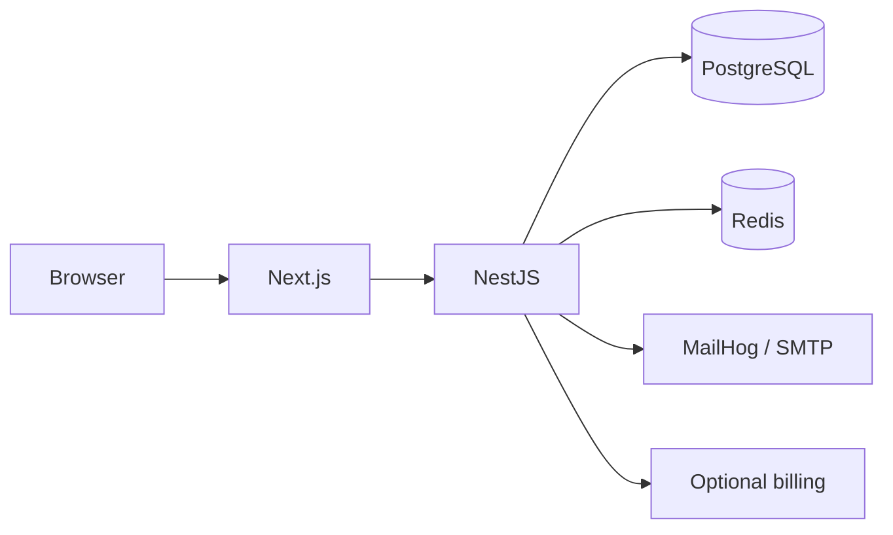
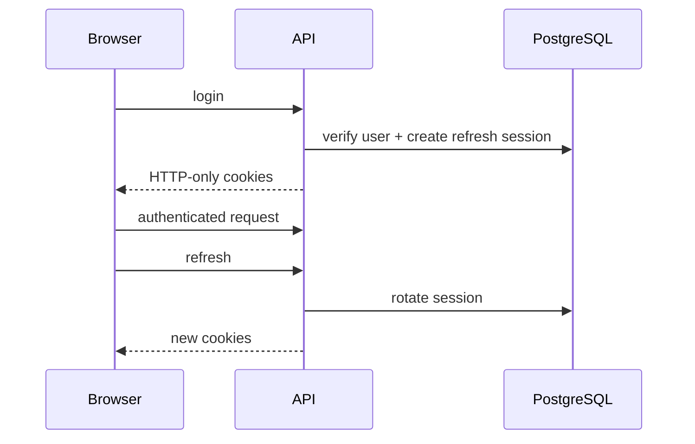

# SaaS Starter

[فارسی](./README.fa.md)

Production-minded full-stack SaaS boilerplate built with Next.js, NestJS, PostgreSQL and Redis in a pnpm monorepo.


## Quick start

1. cp .env.example .env
2. docker compose up --build
3. Open http://localhost:3000

For local hot reload, use `docker compose -f docker-compose.dev.yml up --build`.

MailHog is available at http://localhost:8025. The seeded admin account is controlled by DEFAULT_ADMIN_EMAIL and DEFAULT_ADMIN_PASSWORD. Change the password before using this outside local development.

## Architecture



## Project layout

```text
apps/
  api/       NestJS API, Prisma schema, migrations and tests
  web/       Next.js App Router application and browser tests
packages/
  shared/    framework-neutral Zod schemas and TypeScript contracts
.github/     CI and dependency automation
```

## Included

- Next.js App Router, TypeScript strict and Tailwind
- NestJS, Prisma and PostgreSQL
- Argon2 password hashing
- Short-lived access JWT + rotating, hashed refresh tokens
- Refresh-token family reuse detection
- Email verification and password reset mail abstraction
- USER / ADMIN RBAC
- Organization OWNER / MEMBER roles and tenant isolation
- Projects sample domain
- Audit logging, health checks, Helmet, Swagger and structured logs
- Responsive dashboard, dark/light mode and English/Persian-ready structure
- Optional Stripe billing skeleton with mock mode
- Docker Compose, MailHog, CI, Dependabot and tests

## Multi-tenancy

Organization-owned records carry organizationId. A reusable guard checks membership before organization-scoped controllers execute, while services accept an explicit organization id. This gives a clear application-level isolation boundary in a single PostgreSQL schema.

## Auth flow



A rotated refresh token is never accepted again; presenting it revokes its family.

## API

| Method | Endpoint |
|---|---|
| POST | /auth/register |
| POST | /auth/login |
| POST | /auth/refresh |
| POST | /auth/logout |
| GET | /auth/me |
| POST | /auth/verify-email |
| POST | /auth/forgot-password |
| POST | /auth/reset-password |
| GET/PATCH | /users, /users/me |
| PATCH | /users/:id/role |
| PATCH | /users/:id/status |
| POST/GET | /organizations |
| POST | /organizations/:id/invitations |
| POST | /organizations/invitations/accept |
| GET/POST/PATCH/DELETE | /organizations/:id/projects |
| GET | /admin/audit-logs |
| GET | /health, /health/ready |
| POST | /billing/checkout |
| POST | /billing/portal |
| POST | /billing/webhook |

## Adding a module

Create a feature directory in apps/api/src/modules, add its Prisma model and migration, keep DTOs close to the module, apply authentication/organization guards as appropriate, add service and e2e tests, then add a typed query hook and route in apps/web. Keep Prisma types out of the frontend.

## Design decisions

Prisma is used for typed database access and readable migrations. Refresh credentials are HTTP-only cookies and only their hashes are persisted. Access tokens are short-lived. Redis is an operational dependency for production rate limiting/session controls but the starter remains easy to boot locally.

## Quality gates

The repository keeps quality checks close to the developer workflow: linting, strict type checking, API/web tests and production builds are executed by CI. Authentication tests include refresh-token rotation, reuse detection and the concurrent-claim path.

## Deployment

For a VPS, run the production Compose stack behind an HTTPS reverse proxy such as Nginx. Set COOKIE_SECURE=true, use strong random secrets, restrict CORS and replace MailHog with SMTP. Next.js can also be deployed to Vercel while the API, PostgreSQL and Redis remain managed/containerized services.

## Roadmap

Passkeys, background jobs, object storage, PostgreSQL RLS, richer subscription entitlements and OpenTelemetry.

See CONTRIBUTING.md and SECURITY.md before contributing.
